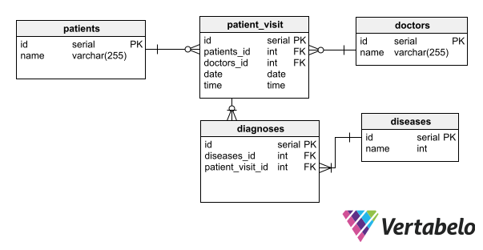
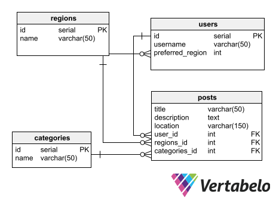
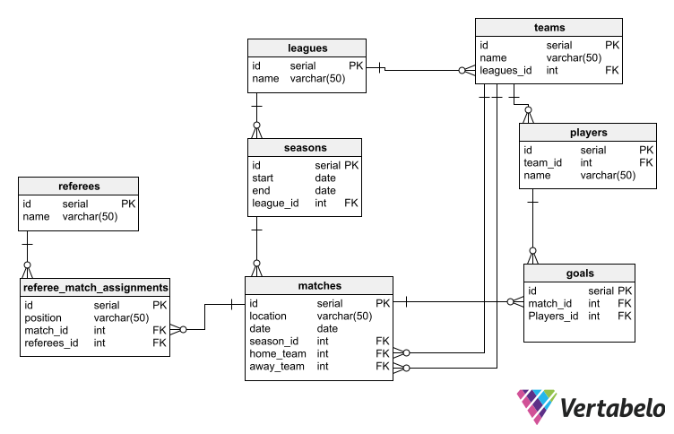

# DATA MODELING EXERCISES

## Medical Center

**Design Requirements**

- A mdedical center employs several doctors
- A doctor can see many patients
- A patient can be seen by many doctors
- During a visit, a patient may be diagnosed to have one or more diseases.

**Data Model**

[Medical Center Data Model](https://my.vertabelo.com/public-model-view/PuKnunlqQGk2zMLE6j5a9WhAWDpmbwxIfMVff22uEFVUHOcMupKILrS4HV8pY1Um?x=7022&y=7838&zoom=1.1367)

## Craigslist

**Design Requirements**

- The region of the craiglist post
- Users and preferred region
- Posts: contains title, text, the user who has posted, the location of the posting, the region of the posting
- Category that each post belongs to

**Data Model**

[Craigslist Data Model](https://my.vertabelo.com/public-model-view/046a83crdnK9UMrUnt5EUncipo8ZC3NdMcmYZ4UaJAPbUOePq0bHfAKtRpYGqKfI?x=8219&y=8740&zoom=1.3026)

## Soccer League

**Design Requirements**

- All of the teams in the league
- All of the goals scored by every player for each game
- All of the referees who have been part of each game
- All of the matches played between teams
- ALl of the start and end dates for season that a league has
- The standings/rankings of each team in the league

**Data Model**

[Soccer League Data Model](https://my.vertabelo.com/public-model-view/v0oxcDv7PM2OKMy1F3yWhXJiZ6QyPi2k2FYXuYBPXwQJAUMPF6DrU8BwGiUslxIP?x=2792&y=4287&zoom=0.8415)

